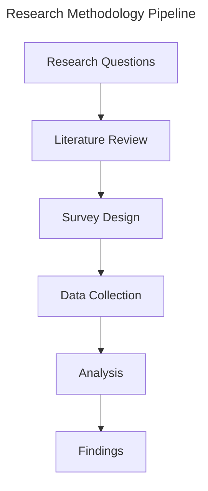
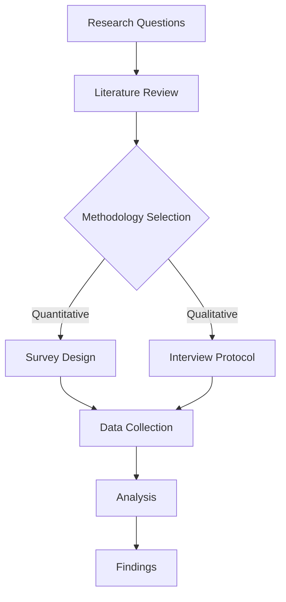
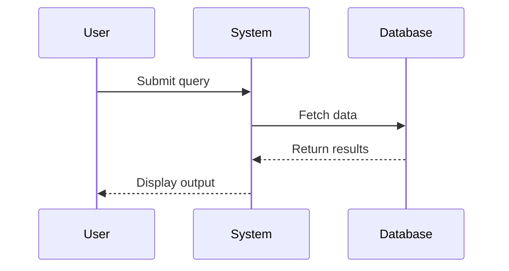
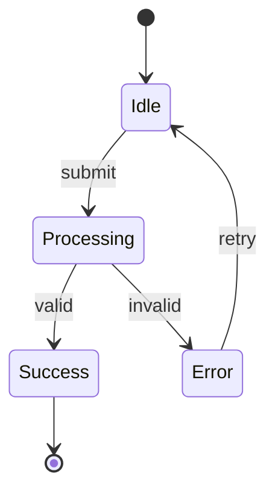

# Diagram Master Agent — Implementation Plan for ARG-RESEARCHER-V4.1

**Version**: 1.1  
**Date**: 2026-05-17  
**Target**: Integrate into `academic-paper` skill + `academic-pipeline` orchestrator  
**Scope**: `/arg-full`, `/arg-plan`, and standalone `/arg-diagram` mode  

> **v1.1 Engine Decision** (confirmed by collision-test benchmarks, 2026-05-17):  
> **Raw TikZ is the primary output engine for all diagram categories.**  
> Mermaid is retained as a secondary engine for flowcharts and simple process/sequence diagrams ONLY.  
> PlotNeuralNet-style TikZ patterns are the standard for neural/ML architecture diagrams (Category 9).  
> This was validated empirically: TikZ produced full geometric precision at 46 KB vs Mermaid's 90 KB process-flowchart-only output.

---

## 1. Problem Statement

The current ARG system has a `visualization_agent` (Dr. Meera) that handles ONLY quantitative data charts via matplotlib/seaborn/ggplot2. There is **no agent** that generates:

- Structural architecture diagrams (system designs, framework overviews)
- Methodology flowcharts (research design, data collection pipelines)
- Theoretical framework visualizations (concept maps with precise relationships)
- Process diagrams (stage-by-stage workflows, decision trees)
- Mathematical diagrams (commutative diagrams, geometric illustrations)
- Technical schematics (neural network architectures, protocol sequences)
- Comparison/taxonomy diagrams (hierarchical classifications, Venn-style relationships)

These diagrams are **essential** for publication-quality papers but currently require manual creation outside the pipeline.

---

## 2. Design Principles

1. **Auto-detection** — The agent identifies where diagrams would strengthen the paper WITHOUT user prompting
2. **TikZ-primary output** — Raw PGF/TikZ is the default and preferred engine for all diagram types. Mermaid is a secondary engine used only for: (a) flowcharts/process flows where spatial geometry is irrelevant, (b) sequence and state diagrams, (c) quick draft previews before LaTeX finalization
3. **Pipeline-native** — Integrates at defined hook points in the existing 8-phase workflow and 10-stage pipeline
4. **Non-blocking** — Diagram generation runs parallel to drafting where possible; never blocks the pipeline
5. **Compilable-first** — All generated code must be syntactically valid and compilable without modification
6. **Coexistence** — Works alongside `visualization_agent` (Dr. Meera handles data charts; Diagram Master handles structural/conceptual diagrams)

---

## 3. Architecture Overview

```
┌─────────────────────────────────────────────────────────────────────┐
│                     DIAGRAM MASTER SYSTEM                            │
├─────────────────────────────────────────────────────────────────────┤
│                                                                     │
│  ┌─────────────────┐    ┌──────────────────┐   ┌────────────────┐  │
│  │ Diagram Planner │───▶│ Diagram Generator│──▶│Diagram Validator│  │
│  │  (Detection &   │    │  (Code Synthesis)│   │ (Compilation & │  │
│  │   Scheduling)   │    │                  │   │  Visual Check) │  │
│  └─────────────────┘    └──────────────────┘   └────────────────┘  │
│         │                        │                      │           │
│         ▼                        ▼                      ▼           │
│  ┌─────────────┐         ┌─────────────┐       ┌─────────────┐    │
│  │Diagram Plan │         │ TikZ / Mermaid│       │ Validated   │    │
│  │  Artifact   │         │   Raw Code   │       │  Diagrams   │    │
│  └─────────────┘         └─────────────┘       └─────────────┘    │
│                                                                     │
└─────────────────────────────────────────────────────────────────────┘
```

### 3.1 Three Internal Sub-Roles (Single Agent, Three Modes)

| Sub-Role | Purpose | Activation Point |
|----------|---------|-----------------|
| **Planner** | Scans outline/draft → identifies diagram opportunities → produces Diagram Plan | Phase 2 (ARCHITECTURE) in academic-paper; Stage 1 in arg-plan |
| **Generator** | Takes Diagram Plan items → synthesizes TikZ/Mermaid code | Phase 4 (DRAFTING) in academic-paper |
| **Validator** | Checks syntax validity, spatial coherence, label correctness | Phase 5 (post-draft, pre-review) |

---

## 4. Diagram Taxonomy & Detection Logic

### 4.1 Supported Diagram Types

| # | Category | Diagram Types | **Primary Engine** | Secondary (drafts only) |
|---|----------|--------------|-------------------|-------------------------|
| 1 | **Methodology** | Research design flowcharts, data collection pipelines, sampling procedures | **TikZ** (nodes + arrows) | Mermaid `flowchart` |
| 2 | **Architecture** | System architecture, framework overviews, layered models, component diagrams | **TikZ** (`fit`, `positioning`) | Mermaid `flowchart` |
| 3 | **Process/Workflow** | Multi-stage pipelines, decision trees, algorithm flowcharts | **TikZ** (flowchart pattern) | Mermaid `flowchart` |
| 4 | **Theoretical Framework** | Concept maps, variable relationship models, causal diagrams | **TikZ** (`mindmap` or manual nodes) | — |
| 5 | **Sequence/Protocol** | Interaction sequences, protocol exchanges, temporal ordering | **TikZ** (`pgf-umlsd` or manual) | Mermaid `sequenceDiagram` |
| 6 | **Hierarchy/Taxonomy** | Classification trees, organizational hierarchies, ontologies | **TikZ** (`forest` package) | — |
| 7 | **Comparison** | Feature matrices, paradigm comparisons (as visual diagrams, not tables) | **TikZ** (matrix nodes) | — |
| 8 | **Mathematical** | Commutative diagrams, geometric constructions, proof trees | **TikZ** (`tikz-cd`) | N/A — TikZ only |
| 9 | **Neural/ML Architecture** | CNN/RNN/Transformer architectures, model pipelines | **TikZ** (PlotNeuralNet patterns) OR **PlotNeuralNet** Python script | — |
| 10 | **Network/Graph** | Citation networks, collaboration graphs, dependency graphs | **TikZ** (`tikz-network` or raw) | — |
| 11 | **Timeline** | Historical progressions, literature evolution, project timelines | **TikZ** (manual timeline) | Mermaid `gantt` |
| 12 | **State Machine** | System states, FSM representations, protocol states | **TikZ** (`automata` library) | Mermaid `stateDiagram-v2` |

### 4.2 Auto-Detection Heuristics

The Planner sub-role scans the paper outline and draft for these signals:

```
DETECTION TRIGGERS:
├── Methodology section present?
│   └── YES → Flag: "Methodology flowchart" (Type 1)
│
├── Multi-step process described in prose?
│   └── YES → Flag: "Process diagram" (Type 3)
│
├── Theoretical framework discussed with ≥3 interconnected concepts?
│   └── YES → Flag: "Framework visualization" (Type 4)
│
├── System/architecture with ≥3 components mentioned?
│   └── YES → Flag: "Architecture diagram" (Type 2)
│
├── Sequence of interactions between ≥2 entities?
│   └── YES → Flag: "Sequence diagram" (Type 5)
│
├── Classification or taxonomy with ≥2 levels?
│   └── YES → Flag: "Hierarchy diagram" (Type 6)
│
├── Mathematical category theory / morphisms present?
│   └── YES → Flag: "Commutative diagram" (Type 8)
│
├── ML/DL model architecture discussed?
│   └── YES → Flag: "Neural architecture diagram" (Type 9)
│
├── Comparison of ≥3 approaches/systems with multiple dimensions?
│   └── YES → Flag: "Comparison diagram" (Type 7)
│
└── DEFAULT: If section word count > 500 and purely prose
    └── ADVISORY: "Consider visual aid"
```

### 4.3 Diagram Necessity Scoring

Each detected opportunity is scored (1-5):

| Score | Label | Action |
|-------|-------|--------|
| 5 | **Essential** | Generate automatically, include in draft |
| 4 | **Strongly Recommended** | Generate, present to user for approval |
| 3 | **Recommended** | Suggest in Diagram Plan, generate on request |
| 2 | **Optional** | Note in Diagram Plan only |
| 1 | **Decorative** | Suppress (anti-pattern: diagrams that add no information) |

---

## 5. Integration Points

### 5.1 Integration into `/arg-plan` (Plan Mode)

**Where**: After `socratic_mentor_agent` completes chapter-by-chapter planning (Plan Step 2-3)

**New Step**: "Diagram Planning Pass"

```
PLAN MODE FLOW (MODIFIED):
Step 0: Configuration Interview (intake_agent)
Step 1: Socratic chapter guidance (socratic_mentor_agent)
Step 2: Argument stress test (argument_builder_agent)
Step 3: ★ NEW — Diagram Plan (diagram_master_agent / Planner mode)
         - Scan completed Chapter Plan
         - Identify diagram opportunities per chapter
         - Score each opportunity (1-5)
         - Output: Diagram Plan artifact (list of diagrams with type, placement, description)
Step 4: Final Chapter Plan + INSIGHT Collection + Diagram Plan
```

**Output Artifact**: `diagram_plan.md` — a structured list:

```markdown
## Diagram Plan

### Figure D1: Research Methodology Flow
- **Section**: Chapter 3 (Methodology)
- **Type**: Methodology Flowchart (Category 1)
- **Engine**: TikZ (nodes + arrows, Section 13.1 pattern)
- **Necessity Score**: 5/5 (Essential)
- **Description**: Shows the 4-phase mixed-methods data collection pipeline
- **Key Elements**: Survey design → Sampling → Data collection → Analysis stages

### Figure D2: Theoretical Framework
- **Section**: Chapter 2 (Literature Review)
- **Type**: Concept Map (Category 4)
- **Engine**: TikZ (nodes + edges)
- **Necessity Score**: 4/5 (Strongly Recommended)
- **Description**: Maps relationships between cognitive load theory constructs
- **Key Elements**: Intrinsic load, extraneous load, germane load → learning outcomes
```

### 5.2 Integration into `/arg-full` (Full Pipeline)

**Modified Phase Structure in academic-paper skill:**

```
Phase 0: CONFIG        -> [intake_agent]              -> Paper Configuration Record
Phase 1: RESEARCH      -> [literature_strategist]     -> Search Strategy + Source Corpus
Phase 2: ARCHITECTURE  -> [structure_architect]       -> Paper Outline + Evidence Map
Phase 2D: ★ DIAGRAM PLAN -> [diagram_master/Planner] -> Diagram Plan (parallel with Phase 3)
Phase 3: ARGUMENTATION -> [argument_builder]          -> Argument Blueprint
Phase 4: DRAFTING      -> [draft_writer + diagram_master/Generator] -> Draft + Embedded Diagrams
Phase 5a: CITATIONS    -> [citation_compliance]       -> Citation Audit
Phase 5b: ABSTRACT     -> [abstract_bilingual]        -> Bilingual Abstract
Phase 5c: ★ DIAGRAM VALIDATION -> [diagram_master/Validator] -> Diagram Audit Report
Phase 6: PEER REVIEW   -> [peer_reviewer]             -> Review Report
Phase 7: FORMAT        -> [formatter]                 -> Final Output Package (with compiled diagrams)
```

**Key design decisions:**
- Phase 2D runs **in parallel** with Phase 3 (no dependency between argument building and diagram planning)
- Phase 4 co-invokes diagram_master/Generator alongside draft_writer for inline diagram embedding
- Phase 5c runs in parallel with 5a and 5b

### 5.3 Integration into `academic-pipeline` Orchestrator

At the pipeline level (10-stage), diagram generation is **embedded within Stage 2 (WRITE)** via the modified academic-paper workflow above. No new top-level stage is needed.

**Additional orchestrator behavior:**
- At Stage 2 → 2.5 handoff: Include generated diagram code in the integrity check material
- At Stage 5 (FINALIZE): `formatter_agent` compiles TikZ diagrams if LaTeX output is requested; converts Mermaid to images for DOCX output

---

## 6. Agent Definition: `diagram_master_agent`

### 6.1 Agent Identity

```markdown
# Diagram Master Agent — Structural & Conceptual Diagram Generation

## Role Definition
You are **Dr. Atlas**, the Diagram Master Agent. You identify where structural,
conceptual, and explanatory diagrams would strengthen an academic paper, then
generate publication-quality diagram code in TikZ or Mermaid. You handle
everything that is NOT a quantitative data chart (those belong to Dr. Meera,
the visualization_agent).

## Persona
- Name: Dr. Atlas
- Specialty: Scientific illustration, information architecture, visual communication
- Philosophy: "A well-placed diagram replaces a thousand words of prose"

## Core Principles
1. **Necessity over decoration** — Every diagram must convey information that prose alone cannot efficiently communicate
2. **Compilable-first** — All generated TikZ/Mermaid code must compile without errors on first attempt
3. **Semantic clarity** — Diagrams encode relationships (hierarchy, sequence, causality, containment) that are immediately parseable
4. **Typographic harmony** — Diagrams use the same fonts, sizing conventions, and terminology as the parent document
5. **Minimal complexity** — Use the simplest diagram type that conveys the point; avoid over-engineering
6. **Standard packages only** — TikZ code uses only widely-available packages (tikz, tikz-cd, forest, circuitikz, pgfplots) — never hallucinate non-existent packages
```

### 6.2 Boundary with `visualization_agent`

| Aspect | `visualization_agent` (Dr. Meera) | `diagram_master_agent` (Dr. Atlas) |
|--------|-----------------------------------|-------------------------------------|
| **Domain** | Quantitative data visualization | Structural/conceptual diagrams |
| **Input** | Numerical data, statistical results | Prose descriptions, outlines, relationships |
| **Output** | Python/R code → raster images | TikZ/Mermaid code → vector graphics |
| **Trigger** | Paper has quantitative results | Paper has processes, frameworks, architectures |
| **Chart Types** | Bar, line, scatter, forest, funnel, heatmap | Flowcharts, architecture, sequence, taxonomy, commutative |

### 6.3 Generation Strategy per Engine

#### TikZ Generation Rules (PRIMARY ENGINE — used for ALL diagram categories)

```
TIKZ CODE GENERATION PROTOCOL:
1. Always begin with \begin{tikzpicture}[<options>]
2. Use ONLY these standard libraries:
   - positioning, arrows.meta, shapes.geometric, calc, fit
   - tikz-cd (for commutative diagrams)
   - forest (for tree structures)
   - automata (for state machines)
   - mindmap (for concept maps)
3. Define all styles at the top of the tikzpicture via \tikzset{}
4. Use relative positioning (right=of, below=of) over absolute coordinates
5. Label all nodes with semantic names (not node1, node2)
6. Include \caption{} and \label{fig:} for LaTeX integration
7. Maximum 80 nodes per diagram (split into sub-figures if larger)
8. Font: \footnotesize for node labels, \scriptsize for annotations
9. Colors: Use a maximum of 5 distinct colors, prefer academic palette
   (navy, teal, crimson, gold, slate)
10. For neural/ML architecture diagrams (Category 9): use PlotNeuralNet-style
    3D block patterns OR invoke the PlotNeuralNet Python library directly
    (generates TikZ via pyexamples/ → tikzmake.sh pipeline)
```

#### PlotNeuralNet Usage (Category 9 — Neural/ML Architectures)

```
PLOTNEURALNET PROTOCOL:
1. Use for: CNN, ResNet, U-Net, FCN, any convolutional/pooling layer diagrams
2. Invoke: python3 <model_name>.py  (generates .tex) → pdflatex compile
3. For Transformers/Attention/RNNs where PlotNeuralNet lacks support:
   → Fall back to hand-crafted TikZ (3D box patterns from PlotNeuralNet source)
4. Output: TikZ code → PDF figure
5. Repo: https://github.com/HarisIqbal88/PlotNeuralNet
6. LIMITATION: No pip install — must clone repo. No RNN/Transformer examples built-in.
```

#### Mermaid Generation Rules (SECONDARY ENGINE — flowcharts and sequences only)

```
MERMAID CODE GENERATION PROTOCOL:
USE ONLY when: (a) output format is Markdown and LaTeX is NOT required, OR
               (b) user explicitly requests a quick draft/preview, OR
               (c) diagram type is sequence/state and TikZ overhead is unjustified
DO NOT USE for: geometric diagrams, architecture diagrams, anything requiring
                spatial precision, any diagram going into a LaTeX paper.

1. Use the appropriate diagram type keyword:
   - flowchart TD/LR for process flows (ONLY if TikZ is not required)
   - sequenceDiagram for interactions
   - stateDiagram-v2 for state machines
   - gantt for timelines (quick draft only)
2. Keep node labels concise (≤5 words)
3. Use subgraph blocks for logical grouping
4. Apply consistent arrow types (-->, -.->  for different relationship strengths)
5. Maximum 30 nodes per diagram (split if larger)
6. Include a title via `---\ntitle: ...\n---` header
7. For LaTeX integration: wrap in \begin{mermaid}...\end{mermaid} (requires ltmermaid package)
   OR export as PDF and use \includegraphics
```

---

## 7. Output Format & Templates

### 7.1 Diagram Code Block Format (Embedded in Paper)

> **Engine hierarchy**: TikZ (primary) → PlotNeuralNet Python (Category 9) → Mermaid (flowcharts/sequences, secondary)

For LaTeX output:
```latex
% --- Figure D1: Research Methodology Flow ---
% Generated by: diagram_master_agent (Dr. Atlas)
% Type: Methodology Flowchart | Engine: TikZ
\begin{figure}[htbp]
  \centering
  \begin{tikzpicture}[
    stage/.style={rectangle, draw=navy, fill=navy!10, rounded corners,
                  minimum width=3cm, minimum height=1cm, font=\footnotesize},
    arrow/.style={-Stealth, thick, draw=navy!70}
  ]
    % ... diagram code ...
  \end{tikzpicture}
  \caption{Overview of the research methodology pipeline.}
  \label{fig:methodology-flow}
\end{figure}
```

For Markdown output:
````markdown
<!-- Figure D1: Research Methodology Flow -->
<!-- Generated by: diagram_master_agent (Dr. Atlas) -->
<!-- Type: Methodology Flowchart | Engine: Mermaid -->



**Figure 1.** Overview of the research methodology pipeline.
````

### 7.2 Diagram Plan Artifact Schema

```yaml
# Handoff Schema: Diagram Plan (extends shared/handoff_schemas.md)
diagram_plan:
  paper_title: string
  total_diagrams_planned: integer
  output_engine_preference: "tikz" | "mermaid" | "auto"
  diagrams:
    - id: "D1"
      title: string
      section: string  # Which chapter/section it belongs to
      category: integer  # 1-12 from taxonomy
      engine: "tikz" | "mermaid"
      necessity_score: integer  # 1-5
      description: string  # What the diagram shows
      key_elements: list[string]  # Major nodes/components
      relationships: list[string]  # Key edges/connections
      placement: "inline" | "full-page" | "appendix"
      depends_on: list[string]  # Other diagram IDs if hierarchical
```

---

## 8. Workflow for `/arg-plan` Mode (Detailed)

```
USER: /arg-plan "I want to write about transformer architectures for code generation"

STEP 1: intake_agent — Simplified config interview
STEP 2: socratic_mentor_agent — Chapter-by-chapter Socratic dialogue
        (Chapters planned: Introduction, Background, Methodology, 
         Architecture Design, Experiments, Results, Discussion, Conclusion)

STEP 3: ★ diagram_master_agent (PLANNER MODE) activates:
   
   [Dr. Atlas]: Based on your chapter plan, I've identified the following 
   diagram opportunities:

   ┌─────────────────────────────────────────────────────────────┐
   │ DIAGRAM PLAN                                                 │
   ├────┬──────────────────────────┬────────────┬────────────────┤
   │ ID │ Diagram                  │ Section    │ Score │ Engine │
   ├────┼──────────────────────────┼────────────┼───────┼────────┤
   │ D1 │ Transformer Architecture │ Ch.4       │ 5/5   │ TikZ   │
   │ D2 │ Training Pipeline Flow   │ Ch.3       │ 5/5   │ TikZ   │
   │ D3 │ Related Work Taxonomy    │ Ch.2       │ 4/5   │ TikZ   │
   │ D4 │ Attention Mechanism      │ Ch.4.2     │ 4/5   │ TikZ   │
   │ D5 │ Evaluation Protocol      │ Ch.5       │ 3/5   │ TikZ   │
   │ D6 │ Results Comparison       │ Ch.6       │ 2/5   │ Skip   │
   └────┴──────────────────────────┴────────────┴───────┴────────┘

   Shall I proceed with this plan, or would you like to adjust?

STEP 4: Output: Chapter Plan + INSIGHT Collection + Diagram Plan
```

---

## 9. Workflow for `/arg-full` Mode (Detailed)

```
PHASE 2 COMPLETE: structure_architect produces outline
                  ↓
PHASE 2D (PARALLEL WITH PHASE 3):
   diagram_master_agent/Planner scans outline → produces Diagram Plan
                  ↓
PHASE 4 (DRAFTING):
   draft_writer_agent writes section-by-section
   FOR EACH section with a planned diagram (score ≥ 4):
     → diagram_master_agent/Generator produces code
     → Code is embedded inline in the draft at the appropriate location
     → draft_writer_agent references the figure in prose ("As shown in Figure X...")
                  ↓
PHASE 5c (PARALLEL WITH 5a, 5b):
   diagram_master_agent/Validator checks ALL generated diagrams:
     1. Syntax validation (TikZ: check for balanced braces, valid commands;
        Mermaid: check for valid keywords and structure)
     2. Label consistency (do node labels match terminology used in text?)
     3. Completeness (does the diagram include all key elements from the plan?)
     4. Cross-reference check (is every diagram referenced in the text?)
                  ↓
   OUTPUT: Diagram Audit Report
     - List of diagrams with pass/fail status
     - Any diagrams that need regeneration
     - Suggestions for additional diagrams missed in planning
```

---

## 10. Standalone Mode: `/arg-diagram`

A new standalone mode for generating diagrams on demand (outside the pipeline):

```yaml
# New entry in MODE_REGISTRY.md under academic-paper
Mode: diagram
Spectrum: Balanced
Output: Diagram code (TikZ/Mermaid) + LaTeX/Markdown integration code
Oversight: Medium
Triggers: "generate diagram", "create a figure for", "diagram for my paper"
```

**Workflow:**
1. User describes what they need ("I need a flowchart showing my 5-stage data pipeline")
2. `diagram_master_agent` asks 2-3 clarifying questions (components, relationships, engine preference)
3. Generates the diagram code
4. Presents it with integration instructions
5. Iterates based on user feedback (max 3 refinement rounds)

---

## 11. File Structure (New Files to Create)

```
academic-paper/
├── agents/
│   └── diagram_master_agent.md          ★ NEW — Full agent definition
├── references/
│   ├── diagram_taxonomy.md              ★ NEW — 12-category taxonomy + detection logic
│   ├── diagram_generation_protocol.md   ★ NEW — TikZ/Mermaid generation rules
│   ├── diagram_tikz_patterns.md         ★ NEW — Reusable TikZ patterns library
│   └── diagram_mermaid_patterns.md      ★ NEW — Reusable Mermaid patterns library
├── templates/
│   ├── diagram_plan_template.md         ★ NEW — Diagram Plan artifact template
│   └── diagram_code_template.tex        ★ NEW — LaTeX figure wrapper template
└── examples/
    └── diagram_generation_example.md    ★ NEW — Full example of diagram pipeline

shared/
└── handoff_schemas.md                   ★ MODIFY — Add Schema 10: Diagram Plan Handoff

.windsurf/workflows/
├── arg-full.md                          ★ MODIFY — Add diagram phases
├── arg-plan.md                          ★ MODIFY — Add diagram planning step
└── arg-diagram.md                       ★ NEW — Standalone diagram generation workflow

MODE_REGISTRY.md                         ★ MODIFY — Add 'diagram' mode to academic-paper
```

---

## 12. Modification to Existing Files

### 12.1 `MODE_REGISTRY.md` — Add new mode

```markdown
| `diagram` | Balanced | Diagram code (TikZ/Mermaid) + integration code | Medium | "generate diagram", "create figure", "diagram for" |
```

Total modes: 25 → **26**

### 12.2 `academic-paper/SKILL.md` — Add agent #13

```markdown
| 13 | `diagram_master_agent` | Identify diagram opportunities, generate TikZ/Mermaid structural diagrams, validate diagram syntax and cross-references | Phase 2D / Phase 4 / Phase 5c / Diagram mode |
```

Agent count: 12 → **13**

### 12.3 `arg-full.md` workflow — Add line

```markdown
   - Stage 2: Academic paper drafting (IMRaD or domain-appropriate structure)
     - Includes: Diagram planning (Phase 2D) + diagram generation during drafting (Phase 4)
     - Diagram validation runs parallel with citation check (Phase 5c)
```

### 12.4 `arg-plan.md` workflow — Add step

```markdown
4. After chapter planning completes, invoke diagram_master_agent in Planner mode:
   - Scan the Chapter Plan for diagram opportunities
   - Score each opportunity (1-5 necessity)
   - Present Diagram Plan to user for confirmation
5. Produce a Chapter Plan + INSIGHT collection + Diagram Plan.
```

### 12.5 `shared/handoff_schemas.md` — Add Schema 10

```markdown
## Schema 10: Diagram Plan Handoff

Produced by: diagram_master_agent (Planner mode)
Consumed by: diagram_master_agent (Generator mode), draft_writer_agent, formatter_agent

Fields:
- paper_title: string
- diagrams[]: array of diagram specifications
  - id, title, section, category, engine, necessity_score, 
    description, key_elements, relationships, placement
```

### 12.6 `academic-pipeline/SKILL.md` — Update parallelization note

Add to the existing parallelization opportunity section:

```markdown
- Additionally, `diagram_master_agent` (Planner mode) can run in parallel with 
  `argument_builder_agent` after `structure_architect_agent` completes the outline.
  The Diagram Plan informs Phase 4 diagram generation.
```

---

## 13. TikZ Pattern Library (Key Templates)

### 13.1 Flowchart (Methodology/Process)

```latex
\begin{tikzpicture}[
  node distance=1.5cm,
  stage/.style={rectangle, draw=navy, fill=navy!8, rounded corners=3pt,
                minimum width=3.5cm, minimum height=0.9cm,
                font=\footnotesize\sffamily, text=navy!90},
  decision/.style={diamond, draw=teal, fill=teal!8, 
                   minimum width=2cm, minimum height=1cm,
                   font=\footnotesize\sffamily, inner sep=1pt},
  arrow/.style={-Stealth, thick, draw=navy!60},
  label/.style={font=\scriptsize\sffamily, text=gray!70}
]
  % Nodes placed with relative positioning
  % Edges with semantic labels
\end{tikzpicture}
```

### 13.2 Architecture (Layered System)

```latex
\begin{tikzpicture}[
  layer/.style={rectangle, draw=#1, fill=#1!8, rounded corners=2pt,
                minimum width=8cm, minimum height=1.2cm,
                font=\footnotesize\sffamily},
  component/.style={rectangle, draw=navy, fill=white,
                    minimum width=2.2cm, minimum height=0.7cm,
                    font=\scriptsize\sffamily},
  conn/.style={-Stealth, thick, draw=gray!50}
]
  % Stacked layers with embedded components
\end{tikzpicture}
```

### 13.3 Commutative Diagram (Category Theory)

```latex
\[\begin{tikzcd}
  A \arrow[r, "f"] \arrow[d, "g"'] & B \arrow[d, "h"] \\
  C \arrow[r, "k"'] & D
\end{tikzcd}\]
```

### 13.4 Neural Network Architecture (PlotNeuralNet Style)

```latex
\begin{tikzpicture}[
  layer/.style={rectangle, draw=navy, fill=#1, minimum width=0.5cm,
                minimum height=#2cm, font=\tiny\sffamily},
  conn/.style={->, draw=gray!50, thick}
]
  % 3D-ish blocks representing conv/pool/fc layers
\end{tikzpicture>
```

### 13.5 Taxonomy Tree (Forest Package)

```latex
\begin{forest}
  for tree={
    draw=navy, rounded corners=2pt, fill=navy!5,
    minimum height=0.7cm, minimum width=2cm,
    font=\footnotesize\sffamily, edge={-Stealth, navy!60},
    l sep=1.2cm, s sep=0.8cm
  }
  [Root
    [Branch 1 [Leaf A] [Leaf B]]
    [Branch 2 [Leaf C] [Leaf D]]
  ]
\end{forest}
```

---

## 14. Mermaid Pattern Library (Key Templates)

### 14.1 Methodology Flow (Mermaid — draft/Markdown context only)

> For LaTeX papers, use the TikZ flowchart pattern (Section 13.1) instead.



### 14.2 Sequence Diagram (Mermaid — acceptable when TikZ overhead is unjustified)



### 14.3 State Machine (Mermaid — acceptable when tikz/automata adds no value)



---

## 15. Validation Protocol

### 15.1 TikZ Validation Checklist

```
□ All \begin{} have matching \end{}
□ All braces are balanced
□ Only standard packages used (no hallucinated packages)
□ All referenced nodes exist (no dangling edges)
□ All labels use terminology from the paper text
□ Figure has \caption{} and \label{fig:...}
□ No overlapping nodes (minimum 0.5cm separation)
□ Arrow directions match described relationships
□ Colors are from the defined academic palette
□ Font sizes are consistent (\footnotesize for nodes, \scriptsize for annotations)
```

### 15.2 Mermaid Validation Checklist

```
□ Diagram type keyword is valid (flowchart, sequenceDiagram, stateDiagram-v2, etc.)
□ All node IDs are unique
□ All edge targets reference existing nodes
□ Node labels are concise (≤5 words)
□ Subgraph blocks are properly closed
□ No circular dependencies that would break rendering (unless intentional)
□ Title is present and descriptive
□ Arrow types are consistent within same relationship category
```

### 15.3 Cross-Reference Validation

```
□ Every diagram in the Diagram Plan has been generated
□ Every generated diagram is referenced at least once in the paper text
□ Figure numbering is sequential and matches text references
□ Diagram terminology matches surrounding section terminology exactly
□ No orphan diagrams (generated but never referenced)
```

---

## 16. Error Handling & Fallback Strategy

| Error Scenario | Handling |
|---------------|----------|
| TikZ code fails to compile | Attempt auto-repair (fix common issues: missing semicolons, unescaped underscores, unbalanced braces). If 2nd attempt fails → regenerate with simpler TikZ. If 3rd attempt fails → fall back to Mermaid as last resort only |
| Diagram too complex (>80 nodes) | Split into multiple sub-figures with cross-references |
| User has no LaTeX installation | Default to Mermaid for all diagrams; provide PDF export instructions |
| Conflict with `visualization_agent` | If a figure could be either a data chart or a structural diagram, check: does it require numerical axes? If yes → Dr. Meera. If no → Dr. Atlas |
| Diagram not referenced in text | Validator flags it; either add a reference or remove the diagram |
| User rejects a planned diagram | Remove from plan, adjust figure numbering |

## 17. Integration with Output Formats

| Output Format | Diagram Handling |
|--------------|------------------|
| **LaTeX (.tex)** | TikZ code embedded inline via `\begin{figure}...\end{figure}`; OR `\input{figures/diagram_D1.tex}` for modularity |
| **Markdown (.md)** | TikZ → compile to PDF → embed as image (highest quality); OR Mermaid code blocks for quick draft view |
| **DOCX (via Pandoc)** | TikZ → compiled to PDF → converted to PNG → embedded (via `pdflatex` + `convert`). Mermaid used only if pdflatex unavailable |
| **PDF (via tectonic/pdflatex)** | TikZ compiled natively — always preferred |
| **Neural diagrams** | PlotNeuralNet `.py` → `.tex` → `pdflatex` → `.pdf` → `\includegraphics` |

---

## 18. Configuration Options (Phase 0 Addition)

Add to `intake_agent` configuration interview:

```markdown
## Diagram Preferences (New — Item 10)

10. **Diagram generation**: Would you like structural diagrams auto-generated?
    - [A] Yes, auto-detect and generate (default)
    - [B] Yes, but show me the plan first for approval
    - [C] Only generate when I explicitly request
    - [D] No diagrams needed

    If yes:
    - Preferred engine: TikZ (default) / Mermaid (flowcharts+sequences only) / PlotNeuralNet (neural architectures)
    - Color palette: Default academic / Monochrome / Custom
```

---

## 19. Anti-Patterns (What the Agent Must NOT Do)

1. **Never generate decorative diagrams** — Every diagram must encode information not efficiently conveyed by text alone
2. **Never hallucinate TikZ packages** — Only use packages known to exist on CTAN
3. **Never use absolute coordinates exclusively** — Prefer relative positioning for maintainability
4. **Never generate >3 diagrams for a paper <5000 words** — Maintain text-to-figure ratio
5. **Never duplicate information already in a table** — If a comparison table exists, don't create a redundant comparison diagram
6. **Never generate diagrams for the Abstract or Conclusion** — These sections should be prose-only
7. **Never override `visualization_agent` territory** — Quantitative data with axes = Dr. Meera's domain
8. **Never generate without a plan** — All diagrams must appear in the Diagram Plan before generation (except in standalone `/arg-diagram` mode)

---

## 20. Implementation Priority & Phasing

### Phase A: Foundation (Core Agent + Plan Mode)
1. Create `diagram_master_agent.md` (full agent definition)
2. Create `diagram_taxonomy.md` (detection heuristics)
3. Create `diagram_plan_template.md`
4. Modify `arg-plan.md` to include Diagram Plan step
5. Add to `MODE_REGISTRY.md`

### Phase B: Generation Engine (Full Mode Integration)
6. Create `diagram_generation_protocol.md` (TikZ + Mermaid rules)
7. Create `diagram_tikz_patterns.md` (reusable templates)
8. Create `diagram_mermaid_patterns.md` (reusable templates)
9. Modify `arg-full.md` for Phase 2D/4/5c integration
10. Modify `academic-paper/SKILL.md` (add agent #13, update phases)

### Phase C: Validation & Standalone
11. Add validation protocol to agent definition
12. Create `arg-diagram.md` workflow (standalone mode)
13. Create `diagram_generation_example.md`
14. Modify `shared/handoff_schemas.md` (Schema 10)
15. Modify `academic-pipeline/SKILL.md` (parallelization note)

### Phase D: Polish & Edge Cases
16. Create `diagram_code_template.tex`
17. Add diagram preferences to intake_agent interview
18. Test with example papers across disciplines
19. Document error handling and fallback paths

---

## 21. Success Criteria

| Metric | Target |
|--------|--------|
| Auto-detected diagram opportunities per paper | 3-7 (depending on paper length) |
| First-attempt compilation success rate (TikZ) | ≥90% |
| First-attempt render success rate (Mermaid) | ≥98% |
| Diagrams rejected by user as unnecessary | <20% |
| Cross-reference consistency (diagram ↔ text) | 100% |
| Time added to pipeline | <5% of total pipeline duration |

---

## 22. Dependencies & Prerequisites

- **For TikZ generation**: Paper must target LaTeX output OR user accepts PDF-embedded diagrams
- **For Mermaid generation**: No external dependencies (renders in Markdown natively)
- **For TikZ compilation validation**: Requires `tectonic` or `pdflatex` (already optional dep in ARG)
- **For Mermaid-to-PDF**: Requires `mmdc` (Mermaid CLI) — optional, graceful degradation if absent
- **ltmermaid package**: For native Mermaid-in-LaTeX compilation (optional enhancement)

---

## 23. Summary

The Diagram Master Agent (Dr. Atlas) fills a critical gap in the ARG pipeline: **structural and conceptual diagram generation**. It operates as a three-phase sub-system (Plan → Generate → Validate) that hooks into existing pipeline stages without disrupting the current architecture. It complements—never replaces—the existing visualization_agent (Dr. Meera) by handling everything that isn't a quantitative data chart.

The integration is designed to be:
- **Minimally invasive** — No new top-level pipeline stages; hooks into existing phases
- **Opt-out friendly** — Users can disable via Phase 0 config (option D)
- **Format-agnostic** — Works for both LaTeX and Markdown output pipelines
- **Quality-gated** — Validation phase catches compilation errors before review stage

---

*End of Implementation Plan*
