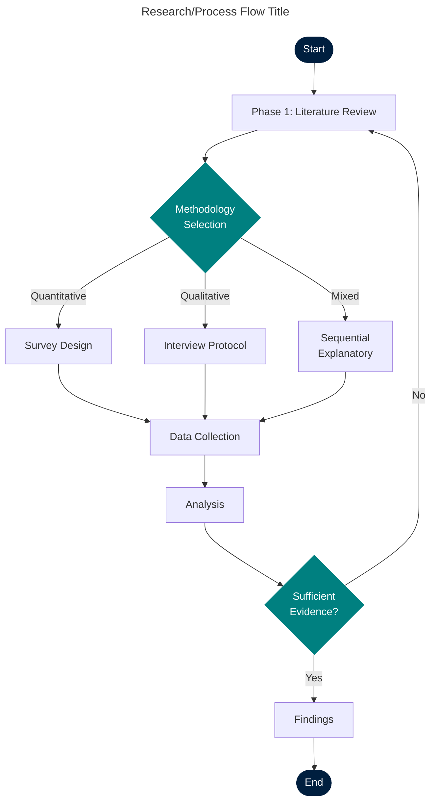
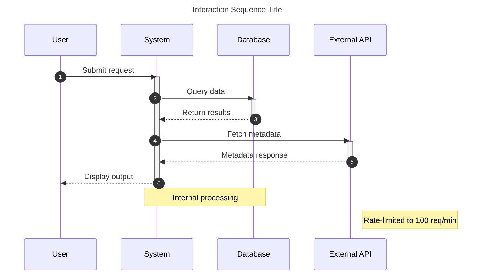
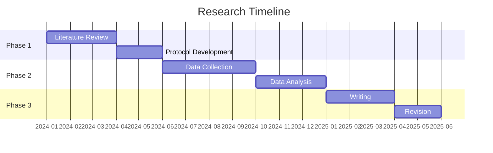
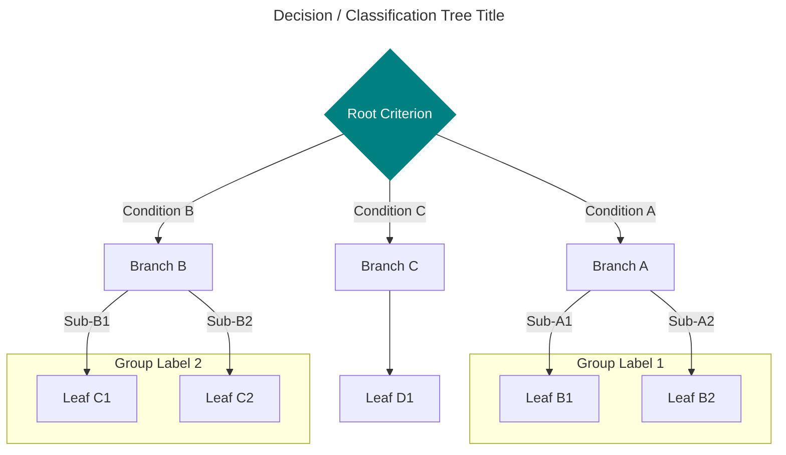

# Mermaid Pattern Library — Secondary Engine Templates for `diagram_master_agent`

> **Restricted use only.** Mermaid is a secondary engine. Use ONLY when:
> - (a) Output is Markdown-only and LaTeX is NOT required
> - (b) User requests a quick draft/preview before LaTeX finalization
> - (c) Diagram type is sequence or state machine and TikZ overhead is unjustified
>
> For LaTeX papers, always prefer TikZ patterns from `diagram_tikz_patterns.md`.
> Always add: `<!-- Mermaid draft — generate TikZ for final LaTeX -->`

---

## Pattern 1 — Methodology / Process Flowchart

**Permitted**: Markdown output only.  
**For LaTeX**: Use TikZ Pattern 1 from `diagram_tikz_patterns.md`.

````markdown
<!-- Figure D[N]: [Title] -->
<!-- diagram_master_agent (Dr. Atlas) | Category 1/3 | Engine: Mermaid (draft) -->
<!-- Mermaid draft — generate TikZ for final LaTeX -->



**Figure [N].** [Caption text.]
````

---

## Pattern 2 — Sequence Diagram

**Permitted**: Mermaid acceptable when TikZ overhead is unjustified (≤10 messages).

````markdown
<!-- Figure D[N]: [Title] -->
<!-- diagram_master_agent (Dr. Atlas) | Category 5 | Engine: Mermaid -->



**Figure [N].** [Caption text.]
````

---

## Pattern 3 — State Machine / FSM

**Permitted**: Mermaid acceptable for simple state diagrams (≤8 states).  
**For complex state machines**: Use TikZ Pattern 6 (automata) instead.

````markdown
<!-- Figure D[N]: [Title] -->
<!-- diagram_master_agent (Dr. Atlas) | Category 12 | Engine: Mermaid -->

```mermaid
---
title: [System State Machine Title]
---
stateDiagram-v2
    [*] --> Idle
    Idle --> Active : initialize
    Active --> Processing : trigger_event
    Processing --> Success : valid_result
    Processing --> Error : invalid_input
    Error --> Active : retry
    Error --> Failed : max_retries_exceeded
    Success --> Idle : reset
    Failed --> [*]

    note right of Processing : Async operation\ntimeout: 30s
    note left of Error : Logged to audit trail
```

**Figure [N].** [Caption text.]
````

---

## Pattern 4 — Gantt / Timeline (Draft Only)

**Permitted**: Markdown draft or quick preview only.  
**For final paper**: Use TikZ Pattern 7 (timeline).

````markdown
<!-- Figure D[N]: [Title] -->
<!-- diagram_master_agent (Dr. Atlas) | Category 11 | Engine: Mermaid (draft only) -->
<!-- Mermaid draft — generate TikZ for final LaTeX -->



**Figure [N].** [Caption text. Note: timeline is approximate.]
````

---

## Pattern 5 — Decision Tree / Classification Flow

**Permitted**: Markdown output only.

````markdown
<!-- Figure D[N]: [Title] -->
<!-- diagram_master_agent (Dr. Atlas) | Category 3 | Engine: Mermaid (draft) -->
<!-- Mermaid draft — generate TikZ for final LaTeX -->



**Figure [N].** [Caption text.]
````

---

## Mermaid Usage Checklist

Before generating any Mermaid diagram, confirm:

- [ ] Output format is confirmed Markdown-only (not LaTeX) OR user explicitly requested draft/preview
- [ ] Mermaid draft comment added: `<!-- Mermaid draft — generate TikZ for final LaTeX -->`
- [ ] Title block present (`---\ntitle: ...\n---`)
- [ ] All node IDs are unique
- [ ] All edge targets reference existing nodes
- [ ] Node labels ≤ 5 words
- [ ] Total nodes ≤ 30
- [ ] Consistent arrow types within same relationship category
- [ ] `style` overrides use hex colors from the academic palette
